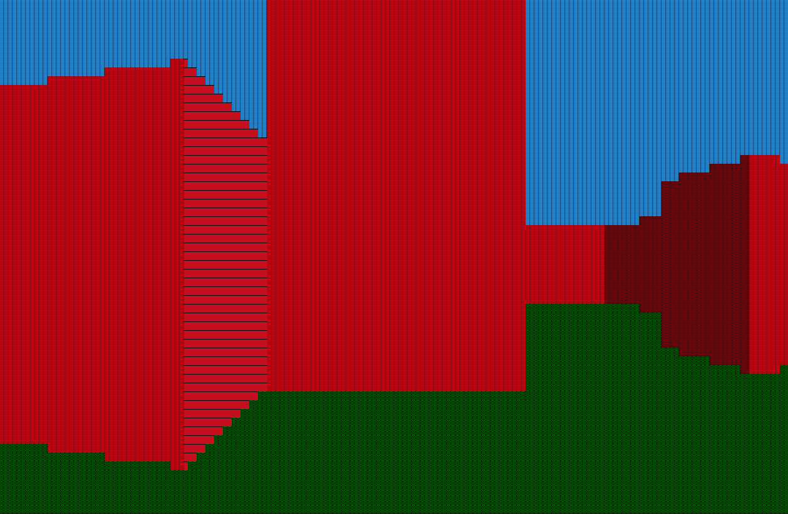
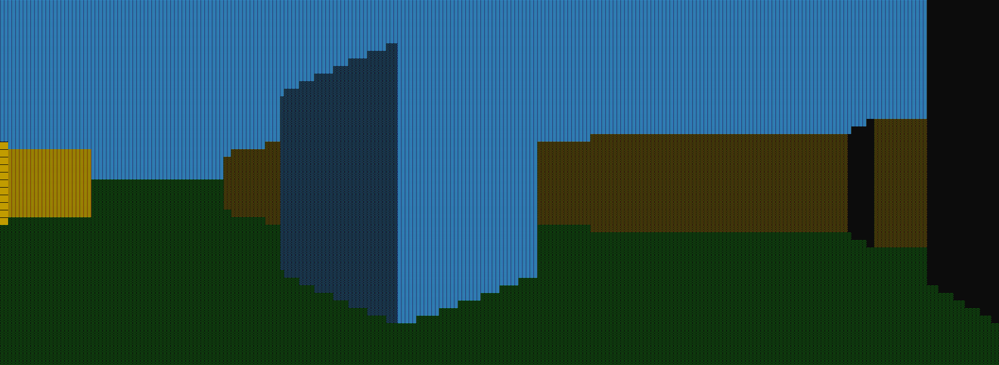
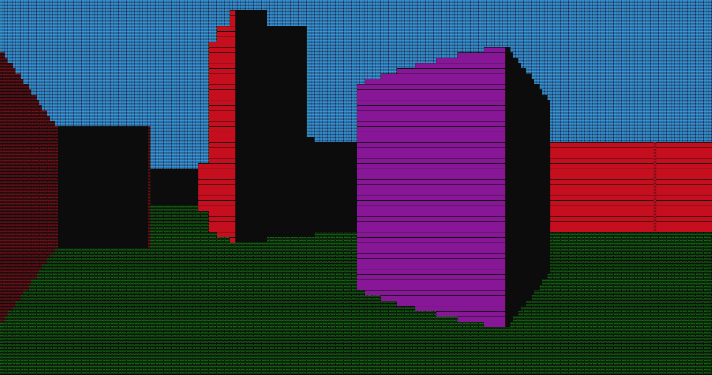
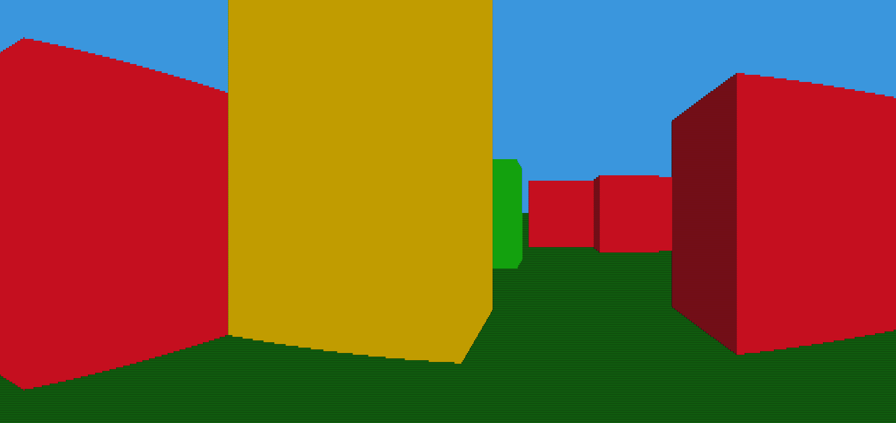

# Pseudo-3D-Terminal-Engine
A pseudo 3D engine that outputs directly to the console terminal. Utilizes the Wolfenstein 3D engine algorithm.
Allows the user to provide keyboard input for movement, camera rotation, and interaction with doors.

Features a customizable color palette, background, and brightness of the voxels to simulate shadow-casting.

Supports 2-dimensional rooms of any size while providing a scalable field of view and straightforward customization.

Fully customizable resolution. HD!

